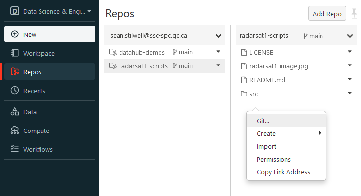
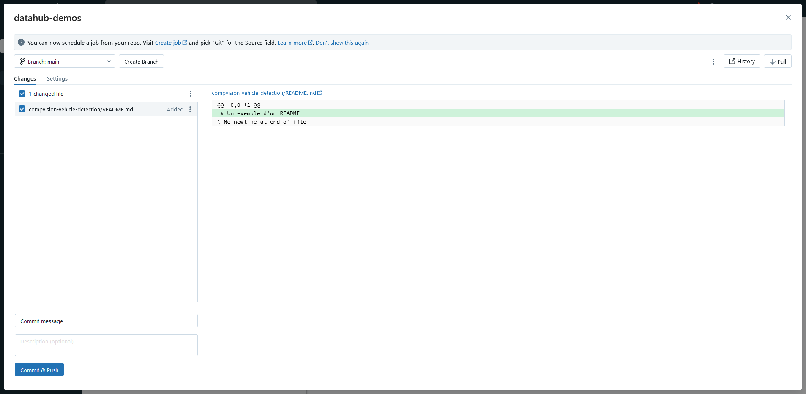
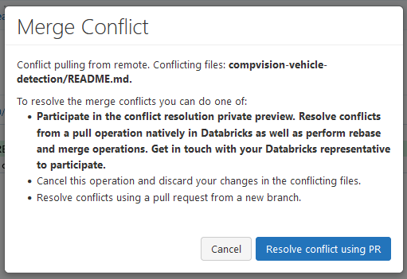

# Git/GitHub Integration with Databricks

## Pre-requisites

- Familiarity with Git version control.
- Have access to a Git repository - the creation and access to a repository is outside the scope of this guide.

## Why use Git/GitHub

- Better version control than built-in change tracker.
- Manage code and notebooks outside Databricks.
- Collaboration across multiple workspaces.

## Workbook vs Repository

- Once you connect Git to Databricks, you can create and use notebooks like normal and also push them to GitHub.
- Workbook files in Git have a slightly different syntax than standard Jupyter Notebooks.

## Part 1: Setup Git/GitHub with Databricks

Navigate to your User Settings from the top right drop down. Select the Git integration tab.

- Select your Git provider
- Configure username
- Generate a Token to give Databricks access to your repository

For GitHub, the access tokens can be created in Settings / Personal Access Token / Tokens (classic). On this page, click "Generate new token" then "Generate new token (classic)".

As a security best practice, we do recommend configuring an expiration date of less than a year. Tokens can easily be regenerated following expiration by following these steps.

The scopes required are `repo` and `workflow` (optional for GitHub Actions workflows)

If the token and access permissions are correctly configured - you should see a green mark in the settings page

## Part 2: Accessing and Modifying Repositories

To clone a repository, you will need its HTTPS access link, and its branch.

Once this is configured, you can see the files inside the repository

Changes done from Databricks can be pushed to the repository using the built-in Git menu. Access it by right clicking in your repo files and clicking "Git...".

This screen will allow you to commit and push changes, as well as pull existing changes.

## Resolving Conflicts

If multiple commits impact the same code, there could be a conflict issue. The following message will appear while attempting to pull code:

Select "Resolve conflict using PR", which opens the following:

This step will ask you to create a new branch where your changes will be committed. Enter a branch name and a commit message then commit the messages again. If successful, you'll see the following message. You can follow the link in that message to make your changes.

<!-- ## Automating Git pulls

?? -->
