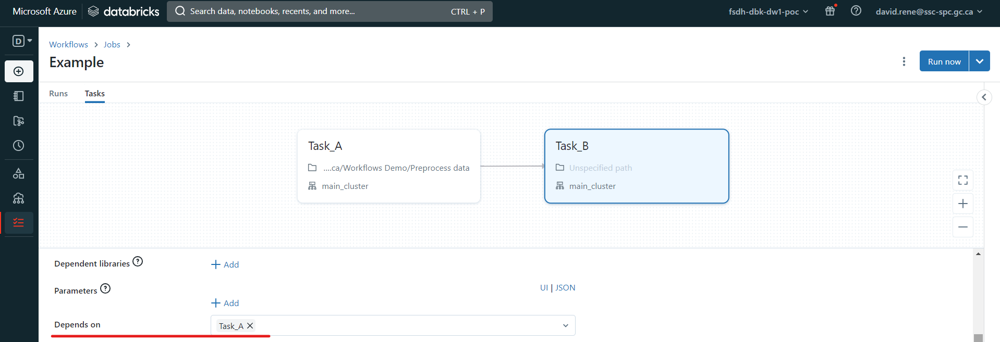
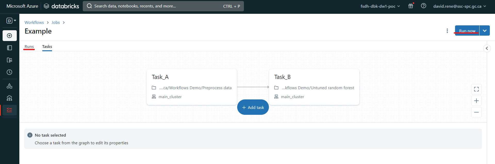

# Databricks Workflows

<video width="600" height="350" controls>
    <source src="/api/media/workflows.mp4" type="video/mp4" />
    <track label="English" kind="subtitles" srclang="en" src="/api/media/workflows.vtt" default/>
    Votre navigateur ne prend pas en charge la balise vidéo.
</video>

Les workflows dans Databricks sont un moyen d'orchestrer les notebooks dans votre environnement. Ils vous fournissent une interface de haut niveau qui vous permet de concevoir des charges de travail de bout en bout, telles que l'apprentissage automatique.

Dans les Databricks Workflows, vous créez des _jobs_. Les _jobs_ sont une liste de _tâches_ dont vous personnalisez l'ordre et la linéarité. Voici un exemple de _job_ contenant 4 _tasks_, dont deux sont exécutées en parallèle :

Les tâches sont les éléments constitutifs des emplois. Elles peuvent être de l'un des types suivants :

- **Notebook** : Une tâche de bloc-notes exécute un bloc-notes dans votre espace de travail. Vous pouvez passer des paramètres à la tâche notebook, et le notebook peut renvoyer un résultat qui peut être utilisé par d'autres tâches.
- Script Python** : cette tâche permet d'exécuter un script Python dans votre espace de travail en utilisant les paramètres de votre choix.
- **Roue Python** : cette tâche vous permettra d'installer des paquets Python sur un cluster sélectionné, au cas où les méthodes d'installation normales ne seraient pas optimales.
- **Spark SQL** : Une tâche Spark SQL exécute une requête SQL sur un cluster Spark. Vous pouvez passer des paramètres à la requête SQL, et la requête peut renvoyer un résultat qui peut être utilisé par d'autres tâches.
- **Tableaux vivants delta** : Cette tâche vous permettra d'exécuter un pipeline de tables dynamiques delta. Les tables dynamiques delta sont un pipeline de flux de données spécial, sur lequel vous pouvez en savoir plus [ici] (https://www.databricks.com/product/delta-live-tables).
- **DBT** : DBT (Data Build Tool) est un outil en ligne de commande open-source qui vous permet de construire, tester et déployer des pipelines de données. Il est souvent utilisé en conjonction avec Databricks pour construire des pipelines de données qui transforment et chargent des données dans un entrepôt de données. DBT vous permet de définir des transformations de données en SQL et vous offre un moyen de tester et de documenter vos pipelines de données. Vous pouvez utiliser DBT pour construire des pipelines de données qui s'exécutent sur Databricks, et vous pouvez également utiliser DBT pour déployer vos pipelines de données dans d'autres environnements.
- **Fichiers JAR** : Cette tâche vous permet d'exécuter un fichier d'archive Java sur un cluster Spark.
- **Spark Submit** : Vous pouvez soumettre n'importe quel fichier Java, Scala, Python ou R en tant que tâche `spark-submit`, qui exécutera ces fichiers sur un cluster Spark.

## **Créer un emploi**

Pour créer un travail, assurez-vous d'être en mode "Data Science & Engineering", puis cliquez sur l'icône "Workflows" dans l'onglet de navigation à gauche, et enfin sur "Create Job" :

Vous accéderez à la page de création d'emploi, où vous configurerez votre première tâche :

Vous pouvez définir le nom, le type et la grappe de la tâche. Il s'agit d'une fonctionnalité intéressante qui vous permet d'optimiser l'utilisation de votre cluster. Une fois que vous avez créé votre première tâche, vous avez la possibilité d'en créer de nouvelles :

Une fois que vous avez créé une deuxième tâche, vous avez la possibilité de définir de quelles autres tâches elle dépend :

Les tâches ne s'exécutent que lorsque toutes les tâches dont elles dépendent ont fini de s'exécuter. Plusieurs tâches peuvent dépendre d'une seule tâche, ce qui crée des flux de travail parallèles, et une seule tâche peut dépendre de plusieurs tâches.

Une fois que vous avez terminé la conception de votre travail, vous pouvez le tester en cliquant sur "Exécuter maintenant" et en cliquant sur "Exécutions" en haut à gauche :

Cela déclenchera votre travail et, à partir de l'écran "runs", vous pourrez contrôler chaque exécution de votre travail ainsi que chaque tâche de vos exécutions.

## **Surveiller un travail**

À partir du menu "Exécutions", vous pouvez facilement contrôler chaque exécution et chaque tâche de vos travaux :

Les diagrammes à barres correspondent à chaque exécution et leur taille correspond au temps nécessaire. Sous chaque barre se trouve une liste de carrés correspondant aux tâches individuelles de vos travaux. Pour chaque élément, les couleurs indiquent l'état : vert pour terminé, rouge pour échec et gris pour annulé.

Dans le tableau du bas, vous pouvez voir et inspecter toutes les exécutions précédentes et en cours.

## **Configuration des emplois et planification**

Lorsqu'un travail est ouvert, à partir de l'onglet "runs" ou de l'onglet "tasks", vous pouvez ouvrir le panneau latéral droit, qui met à votre disposition de nombreuses configurations :

À partir de ce panneau, vous pouvez

- Voir les détails du travail**, tels que l'ID du travail, le créateur du travail, l'utilisateur sous lequel il est exécuté et les balises du travail.
- Configurer Git** : cela vous permet de créer des tâches à l'aide de scripts et de carnets de notes à partir de dépôts distants.
- **Travaux planifiés** : vous pouvez sélectionner des déclencheurs manuels (le travail ne sera exécuté que lorsqu'il sera déclenché à partir de l'interface utilisateur), des déclencheurs planifiés (le travail sera exécuté lorsqu'il sera déclenché à partir de l'interface utilisateur et selon le calendrier fourni) ou des déclencheurs continus (le travail sera déclenché chaque fois que le travail précédent a rencontré une erreur ou a réussi).
- **Voir les détails de calcul** : vous pouvez voir tous les clusters impliqués dans le travail.
  Vous pouvez également les consulter, voir leurs détails, échanger le cluster utilisé, etc.
- Notifications** : définir des notifications (par courrier électronique ou par d'autres fournisseurs) lorsqu'un travail rencontre un problème, réussit ou démarre.
- **Permissions** : permet de sélectionner les personnes qui peuvent visualiser, exécuter et gérer vos travaux.
- **Maximum d'exécutions simultanées** : ce paramètre vous permet de définir le nombre maximum d'exécutions qui peuvent être effectuées en même temps. Par défaut, il est fixé à 1.

Grâce à ces configurations, vous pouvez personnaliser vos travaux comme vous le souhaitez et selon vos besoins.

## **Planification d'un seul cahier**

Dans le cadre de Databricks Workflows, vous pouvez également planifier facilement un carnet de notes. Pour ce faire, naviguez jusqu'au carnet de notes de votre choix et cliquez sur "Schedule" :

Un menu apparaît qui vous permet de planifier l'exécution de ce carnet en tant que tâche unique :

À partir de là, vous pouvez facilement configurer un calendrier ainsi que des alertes pour l'exécution de vos carnets. Une fois votre tâche créée, vous pouvez y accéder à partir du menu Workflows comme n'importe quelle autre tâche :

## **[En savoir plus sur Databricks Workflows](https://docs.databricks.com/workflows/index.html)**
